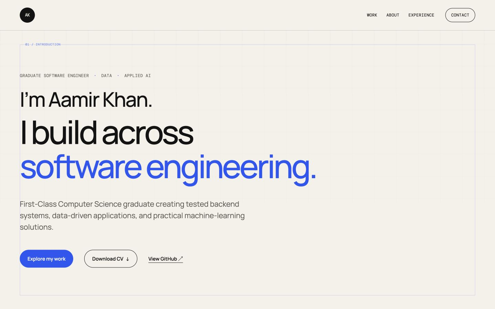
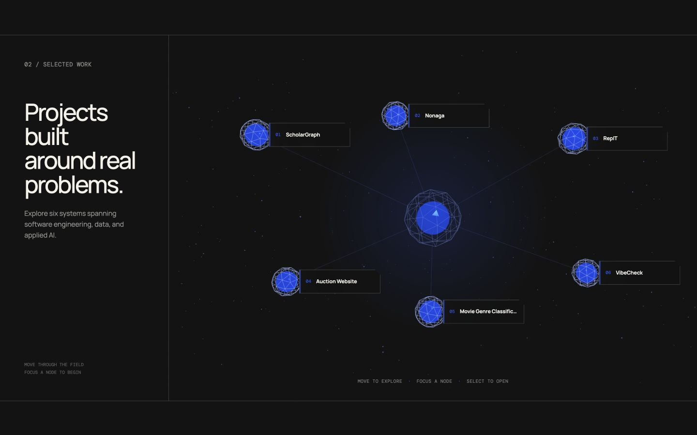

# Aamir Khan — Portfolio

A recruiter-facing portfolio presenting my work across software engineering, data systems, and applied AI.



## Overview

This portfolio is a server-rendered Flask application. It combines a clean editorial interface with a Three.js Project Universe that turns six selected projects into an interactive, spatial navigation experience.

## Highlights

- Kinetic introduction spanning software engineering, data systems, and applied AI
- Interactive 3D Project Universe with keyboard, pointer, and touch support
- Six data-driven project case studies with reusable routing and templates
- Responsive layouts for desktop, tablet, and mobile
- Reduced-motion and non-WebGL fallbacks
- Downloadable CV
- Contextual metadata, sitemap, crawler guidance, and custom error pages
- Browser security and asset-caching policies
- Automated route, navigation, metadata, and content-structure tests

## Project Universe



The universe provides direct access to the selected projects.

Each node reveals a concise dossier before opening the complete case study. The interaction progressively enhances standard links, so the projects remain navigable when WebGL or JavaScript is unavailable.

## Technology

| Area | Technology |
| --- | --- |
| Application | Python, Flask, Jinja |
| Interface | HTML, CSS, Bootstrap, JavaScript |
| 3D experience | Three.js |
| Testing | pytest |

Browser dependencies are loaded explicitly through CDN links, with Bootstrap, Three.js, and Devicon pinned to fixed versions. The application itself requires only Flask at runtime.

## Run locally

Clone the repository and enter the project directory:

```bash
git clone https://github.com/aamirk24/Portfolio.git
cd Portfolio
```

Create and activate a virtual environment:

```bash
python3 -m venv .venv
source .venv/bin/activate
```

On Windows, activate it with:

```powershell
.venv\Scripts\activate
```

Install the dependencies and start the development server:

```bash
python -m pip install -r requirements.txt
flask --app app run --debug
```

Open [http://127.0.0.1:5000](http://127.0.0.1:5000).

## Production preparation

The portfolio is prepared for Cloudflare Pages without changing its Flask development workflow. A Python build step renders the homepage, case studies, discovery files, and custom error page into a static `dist/` directory, then copies the site's assets and Cloudflare response policies alongside them.

```bash
SITE_URL=https://your-domain.example python build_static.py
```

For Cloudflare Pages, use `python build_static.py` as the build command and `dist` as the output directory. `SITE_URL` is optional during previews; set it to the final public address before the production deployment so canonical links and the sitemap use that address.

No Cloudflare project or live deployment has been created yet.

## Structure

```text
app/
├── data/                 Structured portfolio and project content
├── static/
│   ├── css/              Visual system and responsive layouts
│   ├── documents/        Downloadable CV
│   └── js/               Header, hero, and Project Universe behaviour
├── templates/            Homepage, case studies, errors, and sitemap
├── __init__.py           Application factory and response policies
└── routes.py             Homepage, project, and discovery routes
tests/                    Application and content-contract tests
```

## Contact

- [GitHub](https://github.com/aamirk24)
- [LinkedIn](https://www.linkedin.com/in/aamirkhan05/)
- [aamirk2405@gmail.com](mailto:aamirk2405@gmail.com)
